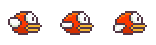

面向对象：专注对象自身的功能
提炼共同点，再选出不同点
像素鸟：
1. 天空(sky)  
    - 移动  
    - 两倍宽度  
    

2. 大地(land)
    - 移动
    - 两倍宽度

3. 小鸟(bird)
    - 煽动翅膀
    - 上下移动
    - 加速度  
    
    ###
    ###
    ---

4. 柱子(pipe):需要（固定宽，随机高，left,top,speedX,speedY,DOM)
    - 柱子对
    - 随机生成柱子对 =>生成柱子的时间间隔即柱子间距离
    - 移动
    - 碰撞检测 => (每根柱子的宽度+小鸟宽度)/2 > (每根柱子的中心点+小鸟的中心点)
共同点:都是方块，都能动

容易出现问题：
因为在父类中定义了Move运动，而在子类中又重复定义相同Move运动
